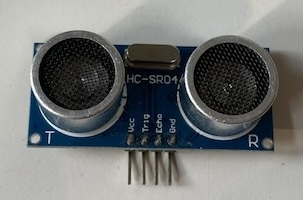

# Low Tech Sensor in retail


## Table of Contents
1. [Introduction](#introduction)
2. [Prerequisites](#prerequisites)
4. [Usage](#usage)
5. [Contributing](#contributing)
6. [License](#license)

## Introduction
Project **Low Tech Retail Sensor** designed to create data based on low cost and low risk


## prerequisites
- CAD/CAM App 1: I am using Fusion 360 to create stl-files.
- 3D print App: I am usning Bambu Studio to connect to our 3d-printer.
- Arduino IDE : To load the software onto the micro-controller
- Components: see image





## Usage
To use this project, follow these steps:

1. Assemble the components according to 
    ```sh

    ```
2. Open your browser and navigate to `http://localhost:3000`.


---

*Created by [Thorbjørn Wulf](https://github.com/cphstud)*

