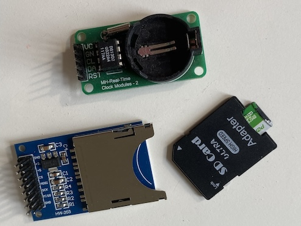

# Low Tech Sensor in retail

## Table of Contents
1. [Introduction](#introduction)
2. [Prerequisites](#prerequisites)
3. [Usage](#usage)
4. [Analysis](#analysis)

## Introduction
Project **Low Tech Retail Sensor** designed to create data based on low cost and low risk

## prerequisites
- CAD/CAM App 1: I am using Fusion 360 to create stl-files.
- 3D print App: I am usning Bambu Studio to connect to our 3d-printer.
- Arduino IDE : To load the software onto the micro-controller
- Components: see image

## Usage
To use this project, follow these steps:

1. Assemble the components according to 
[Assemble hw-203](https://www.aranacorp.com/en/read-and-write-on-a-sd-card-with-arduino)
2. Remember to format the sd-card FAT32.
3. Remember to check if the date is correct
4. Place the sensor within a range of up to 2 meters.

## Analysis
To use the data on the card

1. Load the file into RStudio
2. Use ARIMA to detect patterns

---

*Created by [Thorbjørn Wulf](https://github.com/cphstud)*

